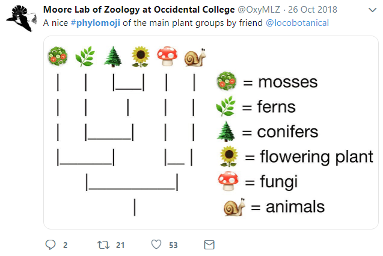

```{r init, include=F}
library(knitr)
opts_chunk$set(message=FALSE, warning=FALSE, eval=TRUE, echo=TRUE, cache=TRUE)
.ex <- 1
# library(ggplot2)
# theme_set(theme_bw(base_size=16) + theme(strip.background = element_blank()))
# knitr::knit_exit()

library(emojifont)
library(ggplot2)
library(ggtree)
```


[#phylomoji](https://twitter.com/hashtag/phylomoji?src=hash) is fun and it is internally supported by **ggtree**.

Here, we will use **ggtree** to recreate the figure:

[](https://twitter.com/OxyMLZ/status/1055586178651451392)


```{r fig.width=7, fig.height=5, warning=F}
library(ggplot2)
library(ggtree)

tt = '((snail,mushroom),(((sunflower,evergreen_tree),leaves),green_salad));'
tree = read.tree(text = tt)
d <- data.frame(label = c('snail','mushroom', 'sunflower',
                          'evergreen_tree','leaves', 'green_salad'),
                group = c('animal', 'fungi', 'flowering plant',
                          'conifers', 'ferns', 'mosses'))
ggtree(tree, linetype = "dashed", size=1, color='firebrick') %<+% d + 
  xlim(0, 4.5) + ylim(0.5, 6.5) +
  geom_tiplab(aes(color=label), parse="emoji", size=15, vjust=.25) +
  geom_tiplab(aes(label = group), geom="label", x=3.5, hjust=.5)
```


With **ggtree**, it is easy to generate phylomoji. The emoji is treated as **text**, like abc. We can use emojis to label taxa, clade, color and ratate emoji with any given color and angle. 


## emoji in cirular layout tree

```{r fig.width=6, fig.height=6, warning=F}
ggtree(tree, layout = "circular", size=1) + 
  geom_tiplab2(aes(color=label), parse="emoji", size=15, vjust=.25)
```

## emoji to label clades

```{r fig.width=6, fig.height=5}
set.seed(123)
tr <- rtree(30)
ggtree(tr) + xlim(NA, 5) +
    geom_cladelabel(node=41, label="chicken", parse="emoji",
                    fontsize=12, align=TRUE, color="firebrick") +
    geom_cladelabel(node=51, label="duck", parse="emoji",
                    fontsize=12, align=TRUE, color="steelblue") +
    geom_cladelabel(node=32, label="family", parse="emoji",
                    fontsize=12, align=TRUE, color="darkkhaki")
```
